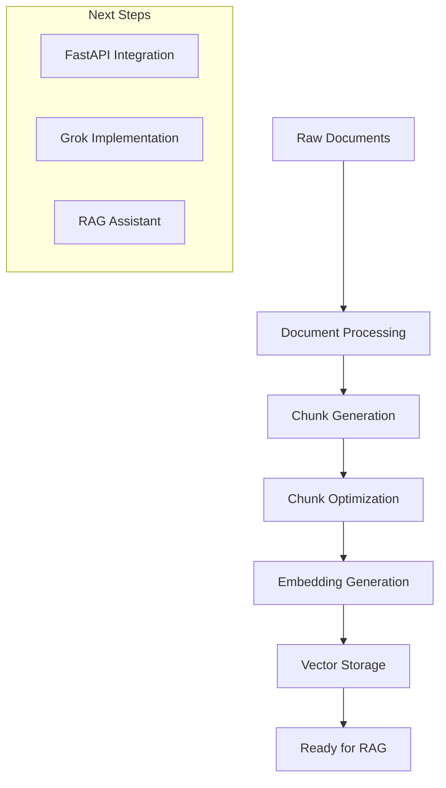

# ERCOT RAG System: Embeddings Implementation

## 1. Overview

### Project Status
- Initial chunks: 7,296
- Optimized chunks: 6,790
- Successfully embedded: 6,790 chunks
- Embedding dimensions: 1024 (JINA AI)
- Document categories processed:
  - Technical documents: 1,844 chunks
  - Excel files: 4,131 chunks
  - Legal documents: 272 chunks
  - Default/Other: 543 chunks

## 2. Implementation Pipeline



## 3. Chunk Optimization Process

### 3.1 Document Type Classification
```python
DOCUMENT_CONFIGS = {
    'technical': {
        'similarity_threshold': 0.98,
        'min_length': 20,
        'preserve_patterns': [
            r'Section \d+\.\d+',
            r'Resource\s+\w+',
            r'[A-Z]{2,}(?:\s+[A-Z]{2,})*',
            r'\d+\s*(?:MW|MVar|kV)'
        ]
    },
    'legal': { ... },
    'excel': { ... }
}
```

### 3.2 Quality Checks
- Empty content detection
- NaN value handling
- Length thresholds
- Content uniqueness
- Technical pattern preservation

### 3.3 Optimization Results
- Low quality chunks removed: 454
- Similar chunks removed: 52
- Tokens saved: 25,658
- Critical content preserved: 100%

## 4. Embedding Generation

### 4.1 JINA AI Implementation
```python
def get_batch_embeddings(texts, api_key):
    url = 'https://api.jina.ai/v1/embeddings'
    headers = {
        'Authorization': f'Bearer {api_key}',
        'Content-Type': 'application/json'
    }
    data = {
        "model": "jina-embeddings-v3",
        "task": "text-matching",
        "dimensions": 1024,
        "input": texts
    }
    # Process and return embeddings
```

### 4.2 Database Schema
```sql
CREATE TABLE embeddings (
    id BIGSERIAL PRIMARY KEY,
    chunk_id BIGINT REFERENCES chunks(id),
    embedding vector(1024),
    model_version TEXT DEFAULT 'jina-embeddings-v3',
    tokens_used INTEGER,
    created_at TIMESTAMP DEFAULT CURRENT_TIMESTAMP,
    CONSTRAINT unique_chunk_embedding UNIQUE(chunk_id)
);
```

### 4.3 Batch Processing
- Batch size: 50 chunks
- Retry mechanism: Exponential backoff
- Error handling: Per-batch recovery
- Progress tracking: Continuous monitoring

## 5. Current System Architecture

```plaintext
ercot_rag/
├── src/
│   ├── db/
│   │   ├── init_db.py
│   │   └── operations.py
│   ├── processing/
│   │   ├── chunk_optimizer.py
│   │   └── document_processor.py
│   └── embedding/
│       └── embedding_generator.py
├── scripts/
│   ├── restore_chunks.py
│   └── verify_processing.py
└── data/
    └── documents/
```

## 6. Next Steps

### 6.1 FastAPI Implementation
1. **Setup Requirements**:
   ```bash
   pip install fastapi uvicorn psycopg2-binary numpy
   ```

2. **Planned Endpoints**:
   - `/search`: Vector similarity search
   - `/query`: RAG query processing
   - `/health`: System status checks

3. **Base Structure**:
   ```python
   from fastapi import FastAPI
   from pydantic import BaseModel
   
   app = FastAPI(title="ERCOT RAG API")
   
   class Query(BaseModel):
       text: str
       top_k: int = 5
   
   @app.post("/search")
   async def search(query: Query):
       # Implement vector search
       pass
   ```

### 6.2 Grok Integration
1. **Requirements**:
   - Grok model access
   - API integration
   - Context window management

2. **Planned Features**:
   - Document context injection
   - Response generation
   - Source attribution

3. **Basic Structure**:
   ```python
   class GrokHandler:
       def __init__(self):
           self.model = setup_grok_model()
           
       async def generate_response(
           self, 
           query: str, 
           context: List[str]
       ) -> str:
           # Implement response generation
           pass
   ```

### 6.3 RAG Assistant Implementation
1. **Core Components**:
   - Query processing
   - Context retrieval
   - Response generation
   - Source tracking

2. **Planned Flow**:
   ```mermaid
   graph LR
       A[User Query] --> B[Query Processing]
       B --> C[Vector Search]
       C --> D[Context Assembly]
       D --> E[Grok Generation]
       E --> F[Response]
       F --> G[Source Attribution]
   ```

3. **Implementation Plan**:
   - Setup FastAPI server
   - Implement vector search
   - Integrate Grok
   - Build response pipeline
   - Add monitoring and logging

## 7. Environment Setup

### Current Requirements
```bash
# Core dependencies
pip install psycopg2-binary python-dotenv langchain
pip install tiktoken tqdm scikit-learn numpy
pip install requests python-dotenv

# For next phase
pip install fastapi uvicorn
pip install numpy pandas
```

### Environment Variables
```plaintext
POSTGRESQL_URI=your_db_uri
JINA_API_KEY=your_key
GROK_API_KEY=your_key  # For next phase
```

## 8. Progress Tracking

### Completed:
- [x] Document processing
- [x] Chunk generation
- [x] Chunk optimization
- [x] Embedding generation

### In Progress:
- [ ] FastAPI setup
- [ ] Vector search implementation
- [ ] Grok integration

### Upcoming:
- [ ] RAG assistant development
- [ ] Response generation
- [ ] System optimization

## 9. Best Practices & Notes

1. **API Key Management**:
   - Use `.env` file
   - Regular key rotation
   - Environment verification

2. **Database Management**:
   - Regular backups
   - Index optimization
   - Query monitoring

3. **System Monitoring**:
   - Response times
   - Token usage
   - Error rates

4. **Documentation**:
   - API documentation
   - System architecture
   - Deployment guides