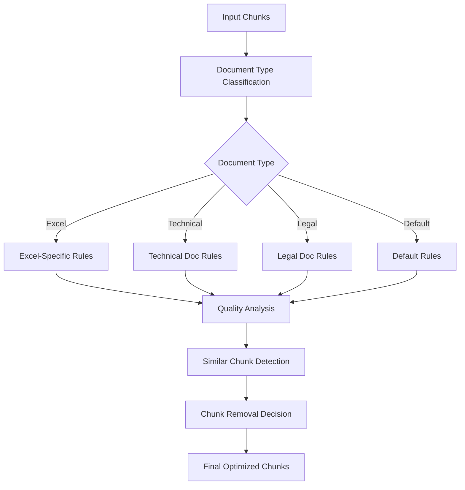

# ERCOT RAG System Documentation

## 1. Project Overview & Current Status
A Retrieval Augmented Generation (RAG) system for ERCOT documentation, focusing on market participant registration and qualification processes.

### Current Status
- Database schema implemented
- Web scraping completed (17 pages)
- Document processing completed (54 documents)
- Chunk optimization completed
- Next: Vector embedding generation

### Data Statistics Post-Optimization
- Total chunks: 6,790 (optimized from 7,296)
- Document types:
  - Excel files: 4,131 chunks
  - Technical documents: 1,844 chunks
  - Legal documents: 272 chunks
  - Default/Other: 1,032 chunks

## 2. Recently Completed: Chunk Optimization

### 2.1 Optimization Pipeline


### 2.2 Document Type Classification
- **Technical Documents**
  - Patterns: checklist, commissioning, specification, protocol, resource, generator, etc.
  - Examples: Generator Commissioning Checklist, Technical Specifications
  - Similarity threshold: 0.98

- **Legal Documents**
  - Patterns: letter of credit, agreement, contract, terms, conditions
  - Examples: Letter of Credit documents, Legal Agreements
  - Similarity threshold: 0.95

- **Excel Documents**
  - Identified by file extension (.xls, .xlsx)
  - Special handling for NaN values and headers
  - Similarity threshold: 0.99

### 2.3 Quality Checks

#### Content Preservation Rules
1. **Technical Content**:
   - Protocol section references
   - Resource identifiers
   - Technical measurements (MW, MVar, kV)
   - QSE comments
   - Contact information

2. **Legal Content**:
   - Section references
   - Legal articles
   - Contract exhibits
   - Legal terminology

3. **Excel Content**:
   - Header rows
   - Valid measurement data
   - Non-NaN content rows
   - Important metadata

#### Low Quality Detection
- Empty or whitespace-only content
- Excessive NaN values in Excel
- Short content below type-specific thresholds
- Repetitive content (< 50% unique words)
- Low alphanumeric ratio

### 2.4 Similarity Detection
- Document-type specific thresholds
- Only compares chunks within same document
- TF-IDF vectorization with cosine similarity
- Preservation rules for critical content

### 2.5 Optimization Results
- Removed 454 low quality chunks
- Removed 52 similar chunks
- Total tokens saved: 25,658
- Preserved all critical technical and legal content

## 3. Database Schema
```sql
-- Current Schema (Unchanged)
CREATE TABLE documents (
    id BIGSERIAL PRIMARY KEY,
    url TEXT NOT NULL,
    title TEXT NOT NULL,
    content_type TEXT NOT NULL,
    file_name TEXT,
    created_at TIMESTAMP DEFAULT CURRENT_TIMESTAMP,
    CONSTRAINT unique_document_url UNIQUE(url)
);

CREATE TABLE chunks (
    id BIGSERIAL PRIMARY KEY,
    document_id BIGINT REFERENCES documents(id) ON DELETE CASCADE,
    content TEXT NOT NULL,
    chunk_index INTEGER,
    created_at TIMESTAMP DEFAULT CURRENT_TIMESTAMP
);

CREATE TABLE embeddings (
    id BIGSERIAL PRIMARY KEY,
    chunk_id BIGINT REFERENCES chunks(id) ON DELETE CASCADE,
    embedding vector(1024),
    model_version TEXT DEFAULT 'jina-embeddings-v3',
    tokens_used INTEGER,
    created_at TIMESTAMP DEFAULT CURRENT_TIMESTAMP,
    CONSTRAINT unique_chunk_embedding UNIQUE(chunk_id)
);
```

## 4. Next Steps: Vector Embeddings

### 4.1 Planned Implementation
1. **Embedding Generation**
   - Use JINA embeddings (1024 dimensions)
   - Process optimized chunks in batches
   - Track token usage
   - Store in embeddings table

2. **Processing Strategy**
   ```python
   # Planned approach
   for chunk_batch in chunks:
       embeddings = generate_embeddings(chunk_batch)
       store_embeddings(embeddings)
       track_token_usage(embeddings)
   ```

3. **Quality Assurance**
   - Verify embedding dimensions
   - Ensure complete coverage
   - Monitor token usage
   - Validate similarity search

### 4.2 Future Work
1. **RAG Implementation**
   - Query processing
   - Vector similarity search
   - Response generation
   - Context integration

2. **System Optimization**
   - Query performance tuning
   - Embedding caching
   - Response quality metrics

## 5. Project Files Structure
```plaintext
ercot_rag/
├── src/
│   ├── db/
│   │   ├── init_db.py
│   │   └── operations.py
│   ├── processing/
│   │   ├── chunk_optimizer.py     # New
│   │   └── document_processor.py
│   └── embedding/                 # Planned
│       └── embedding_generator.py
├── scripts/
│   ├── restore_chunks.py         # New
│   └── verify_processing.py
└── data/
    └── documents/
```

## 6. Key Metrics & Progress
- Documents processed: 54/54 (100%)
- Web pages scraped: 17/17 (100%)
- Chunks optimized: 6,790 (93.1% retained)
- Embeddings generated: 0/6,790 (Next step)

## 7. Environment Setup
```bash
# Current Requirements
pip install psycopg2-binary python-dotenv langchain
pip install tiktoken tqdm scikit-learn numpy

# For next phase (embeddings)
pip install jina