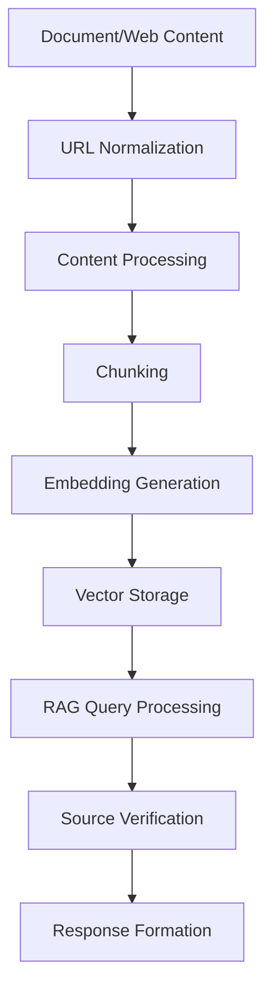

# ERCOT RAG System Development Journey

## 1. Initial Setup and Early Issues

### 1.1 URL Handling Confusion
**Initial Symptom:** URLs in RAG responses were not working (404 errors)

**Investigation Path:**
1. First checked document URLs in database
   ```sql
   SELECT url FROM documents WHERE content_type = 'document';
   ```
   
2. Found multiple URL patterns:
   ```
   https://www.ercot.com/services/rq/document.pdf (404)
   https://www.ercot.com/files/docs/YYYY/MM/DD/document.pdf (200)
   ```

**Root Cause Discovery:**
- Crawler was storing different URL formats for the same document
- Some URLs missing file extensions
- Some URLs using wrong base path

**Failed Attempt #1:**
```python
# Tried simple string replacement - Too naive
url = url.replace('/services/rq/', '/files/docs/')
```

**Failed Attempt #2:**
```python
# Tried adding extensions without checking existing ones
if not url.endswith(('.pdf', '.doc', '.docx')):
    url += '.pdf'
```

**Working Solution:**
```python
def verify_and_fix_url(self, doc_id: int, url: str) -> str:
    # Get complete document info first
    cur.execute("""
        SELECT url, content_type, file_name, title
        FROM documents 
        WHERE id = %s
    """, (doc_id,))
    # ... handle extensions and paths properly
```

### 1.2 Duplicate Document Issues

**Initial Symptom:** Same document appearing multiple times in RAG responses

**Investigation Steps:**
1. Checked database for duplicates:
```sql
SELECT title, COUNT(*) 
FROM documents 
GROUP BY title 
HAVING COUNT(*) > 1;
```

2. Found pattern:
- One entry with working URL
- One entry with non-working URL
- Sometimes additional entries with version suffixes (_v1, _ver2)

**Failed Solution Attempts:**
1. Tried deleting based on URL pattern only:
```sql
DELETE FROM documents 
WHERE url LIKE '%/services/rq/%';
```
Problem: Lost some valid web content

2. Tried keeping newest version only:
```sql
DELETE FROM documents d1
USING documents d2
WHERE d1.title = d2.title 
AND d1.id < d2.id;
```
Problem: Sometimes kept wrong version

**Working Solution:**
```python
def deduplicate_documents():
    """Keep document with working URL, merge content if needed"""
    cur.execute("""
        WITH document_pairs AS (
            SELECT 
                d1.id as good_id,
                d2.id as bad_id
            FROM documents d1
            JOIN documents d2 ON d1.title = d2.title
            WHERE d1.url LIKE '%/files/docs/%'
            AND d2.url LIKE '%/services/rq/%'
        )
        -- Keep content from both but URL from good version
    """)
```

## 2. Content Processing Evolution

### 2.1 Web Content Issues

**Initial Problem:** Web content showing as:
```
"Processed content from https://www.ercot.com/services/rq"
```

**Investigation:**
1. Checked scraping code:
```python
def process_web_content(self, url: str) -> Optional[str]:
    soup = BeautifulSoup(response.text, 'html.parser')
    text = soup.get_text()  # Too simple!
```

2. Found issues:
- Not removing navigation/header/footer
- Not preserving structure
- Not cleaning up formatting

**Failed Attempts:**
1. Tried using simple text extraction:
```python
text = '\n'.join(p.text for p in soup.find_all('p'))
```
Problem: Lost too much structure

2. Tried keeping all HTML:
```python
text = str(soup.find('main'))
```
Problem: Included too much markup

**Working Solution:**
```python
def process_web_content(self, url: str) -> Optional[str]:
    soup = BeautifulSoup(response.text, 'html.parser')
    
    # Remove non-content
    for elem in soup.select('nav, header, footer, script, style'):
        elem.decompose()
        
    # Extract main content
    main_content = soup.select_one('main, article, .content')
    if main_content:
        content = main_content.get_text(separator='\n', strip=True)
    # ... proper content cleaning
```

### 2.2 Excel Processing Challenges

**Initial Issue:** Excel content showing NaN values in chunks

**Investigation Path:**
1. Checked how Excel files were being processed:
```python
def load(self) -> List[Document]:
    sheets = pd.read_excel(self.file_path)
    text = sheet_data.to_string()  # Problem!
```

2. Found multiple issues:
- NaN values being included
- Column headers repeated
- Row indices included

**Solutions Attempted:**
1. Simple NaN replacement:
```python
text = text.replace('NaN', '')
```
Problem: Left strange spacing

2. DataFrame cleaning:
```python
df = df.fillna('')
```
Problem: Lost structure information

**Working Solution:**
```python
def load(self) -> List[Document]:
    if self.file_path.endswith('.xlsx'):
        sheets = pd.read_excel(
            self.file_path, 
            sheet_name=None, 
            na_filter=False  # Prevent NaN
        )
    # Process each sheet properly
```

## 3. Embedding Pipeline Refinement

### 3.1 Chunking Strategy Evolution

**Initial Issue:** Chunks either too small or breaking mid-content

**Investigation:**
1. Checked chunk sizes:
```sql
SELECT 
    AVG(LENGTH(content)),
    MIN(LENGTH(content)),
    MAX(LENGTH(content))
FROM chunks;
```

2. Found problems:
- 500 character chunks too small
- Bad break points in content
- Some chunks meaningless

**Failed Attempts:**
1. Fixed size chunks:
```python
chunks = [content[i:i+1000] for i in range(0, len(content), 1000)]
```
Problem: Broke content arbitrarily

2. Simple sentence splitting:
```python
chunks = content.split('. ')
```
Problem: Lost context between related sentences

**Working Solution:**
```python
def create_chunks(self, content: str, doc_id: int) -> List[Dict]:
    splitter = RecursiveCharacterTextSplitter(
        chunk_size=1000,
        chunk_overlap=100,
        separators=["\n\n", "\n", ". ", "! ", "? "]
    )
```

## 4. RAG Response Formation

### 4.1 Source Citation Issues

**Initial Problem:** Sources either missing or duplicated

**Investigation:**
1. Checked how sources were being tracked:
```python
def format_sources(self, chunks: List[Dict]) -> str:
    # No deduplication
    return '\n'.join(chunk['content'] for chunk in chunks)
```

2. Found issues:
- Same source cited multiple times
- URLs sometimes wrong
- Content not properly attributed

**Failed Attempts:**
1. Simple deduplication:
```python
seen_urls = set()
for chunk in chunks:
    if chunk['url'] not in seen_urls:
        # ... too simple
```

2. Title-based deduplication:
```python
seen_titles = set()
# ... lost relevant content from same source
```

**Working Solution:**
```python
def deduplicate_sources(self, chunks: List[Dict]) -> List[Dict]:
    unique_sources = {}
    for chunk in chunks:
        doc_id = chunk['metadata']['document_id']
        if doc_id not in unique_sources:
            unique_sources[doc_id] = chunk
        else:
            # Merge relevance and highlights
```

## 5. Lessons Learned

### 5.1 Investigation Best Practices
1. Always check database state first
2. Write diagnostic queries to understand scope
3. Test on small subsets before full fixes

### 5.2 Common Pitfalls
1. Assuming URL formats without verification
2. Processing documents without proper content type handling
3. Naive deduplication strategies

### 5.3 Critical Components for Success
1. Proper URL management
2. Content-aware processing
3. Robust chunking strategy
4. Careful source tracking

## 6. Final Working Pipeline



Each component now has:
1. Proper error handling
2. Data validation
3. Logging
4. Recovery mechanisms

## 7. Future Considerations
1. Regular URL verification jobs
2. Content update detection
3. Automated testing of full pipeline
4. Enhanced monitoring and alerting