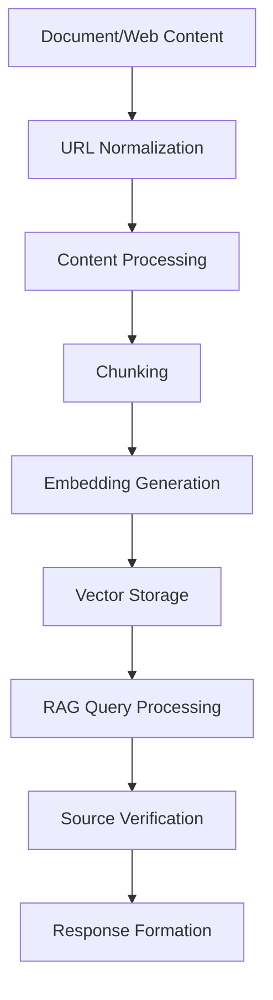

# ISO-Assist:  RAG Application MVP

[](https://iso-assist.onrender.com/)

ISO-Assist is a Retrieval Augmented Generation (RAG) application that demonstrates how to build an end-to-end solution for document processing, embedding generation, and question answering with source citations. This project serves as both a working application and a learning resource for others and me, while building similar systems.

## 🎯 Project Overview

The application currently processes ERCOT (Electric Reliability Council of Texas) documentation, focusing on market participant registration and qualification processes. It provides accurate answers with direct citations to source documents, making it a reliable reference tool.

### Key Features

- Full-text search with semantic understanding
- Source citations with direct document links
- Support for multiple document types (PDF, DOCX, XLSX)
- Vector similarity search using pgvector
- Separate processing pipelines for web content and documents
- Production-grade error handling and monitoring

## 🚀 Tech Stack

All components use free tier services, making it perfect for MVPs and learning:

### Backend
- **Framework**: FastAPI
- **LLM**: Groq (for inference)
- **Embeddings**: JINA AI
- **Vector DB**: Aiven PostgreSQL with pgvector
- **Document Processing**:  langchain
- **Web Scraping**: BeautifulSoup

### Frontend
- **Framework**: Next.js 14
- **Styling**: Tailwind CSS
- **Components**: Custom React components for RAG UI
- **API Integration**: Custom hooks and utilities

### Infrastructure
- **Deployment**: Render (backend + frontend)
- **Monitoring**: Custom logging system
- **Version Control**: Git

## 🛠 Architecture



## 💡 Key Learnings

### 1. URL Management
- Consistent URL formatting is crucial
- Implement proper URL validation and normalization
- Handle redirects and versioned documents

### 2. Content Processing
- Different document types need specialized handling
- Excel files require careful NaN value management
- Web content needs proper HTML cleaning

### 3. Chunking Strategy
- Chunk size affects answer quality
- Use intelligent chunk boundaries
- Maintain context between chunks

### 4. Source Citations
- Implement robust deduplication
- Track document metadata
- Provide verifiable source links

## 🏗 Project Structure

```plaintext
project-root/
├── src/                           # Backend source code (FastAPI)
│   ├── api/                       # API endpoints
│   │   ├── main.py               # FastAPI entry point
│   │   └── models.py             # Pydantic models
│   ├── assistant/                 # RAG logic
│   │   ├── prompts.py            # AI prompts
│   │   └── rag_assistant.py      # Core RAG logic
│   ├── db/                       # Database-related utilities
│   │   ├── setup.py             # Initial DB setup
│   │   └── update_schema.py     # Schema updates
│   ├── processor/                # Data processing and embeddings
│   │   ├── document_processor.py # Document processing
│   │   └── embedding_generator.py # Embedding generation
│   ├── scraper/                  # Scraping utilities
│   │   └── crawler.py           # Web scraping logic
│   └── utils/                    # General utilities
│       └── url_handler.py       # URL management
├── ercot-rag-frontend/           # Frontend app (Next.js)
│   ├── app/                      # App directory
│   │   ├── components/          # React components
│   │   │   ├── rag/            # RAG-specific components
│   │   │   │   ├── AnswerDisplay.tsx
│   │   │   │   ├── CitationMarker.tsx
│   │   │   │   └── SourceList.tsx
│   │   │   └── ui/             # UI components
│   │   └── lib/                # Frontend utilities
│   └── public/                  # Static assets
├── logs/                        # Application logs
├── documents/                   # Project documentation
└── README.md                    # Project documentation
```

## 📝 Data Model Design

### Understanding the Requirements

When building a RAG application, we needed to solve several key challenges:

1. **Content Management**
   - Store both web content and PDF/DOCX/XLSX documents
   - Track source URLs for verification
   - Handle document processing status

2. **Text Processing**
   - Split documents into searchable chunks
   - Maintain document structure and context
   - Enable efficient retrieval

3. **Semantic Search**
   - Store and query vector embeddings
   - Support similarity search
   - Track embedding model versions

### Data Model Evolution

Starting with these requirements, we designed our schema through several iterations:

#### 1. URL and Document Management
First, we needed to track both web pages and documents:

```
URLs (for scraping)
┌─────────┬──────────┬─────────────┐
│ URL     │ Type     │ Status      │
├─────────┼──────────┼─────────────┤
│ /page-1 │ web      │ processed   │
│ /doc-1  │ document │ pending     │
└─────────┴──────────┴─────────────┘

Documents (processed content)
┌────────┬────────┬──────────┬───────────┐
│ URL    │ Title  │ Type     │ Filename  │
├────────┼────────┼──────────┼───────────┤
│ /doc-1 │ Guide  │ PDF      │ guide.pdf │
└────────┴────────┴──────────┴───────────┘
```

This separation helps us:
- Track scraping progress
- Handle different content types
- Maintain source traceability

#### 2. Content Chunking
Next, we needed to break documents into searchable pieces:

```
Chunks
┌─────────────┬────────┬───────┬─────────┐
│ Document ID │ Order  │ Text  │ Length  │
├─────────────┼────────┼───────┼─────────┤
│ 1          │ 1      │ ...   │ 450     │
│ 1          │ 2      │ ...   │ 380     │
└─────────────┴────────┴───────┴─────────┘
```

Why this structure?
- Documents need to be split for relevance
- Order matters for context
- Size impacts answer quality

#### 3. Vector Search
Finally, for semantic search, we needed vector embeddings:

```
Embeddings
┌──────────┬───────────┬─────────┬──────────┐
│ Chunk ID │ Vector    │ Model   │ Tokens   │
├──────────┼───────────┼─────────┼──────────┤
│ 1        │ [0.1,...] │ jina-v3 │ 128     │
└──────────┴───────────┴─────────┴──────────┘
```

This required:
- PostgreSQL with pgvector extension
- HNSW index for similarity search
- Token tracking for costs

### Indexing Strategy

Our choice of indexes was driven by query patterns:

1. **URL Lookups**
   ```sql
   CREATE INDEX idx_documents_url ON documents(url);
   ```
   Why? Quick source verification during responses

2. **Document Reconstruction**
   ```sql
   CREATE INDEX idx_chunks_document ON chunks(document_id);
   ```
   Why? Efficiently rebuild original documents

3. **Vector Search**
   ```sql
   CREATE INDEX embedding_vector_idx ON chunk_embeddings 
       USING hnsw (embedding vector_cosine_ops);
   ```
   Why? Fast similarity search for semantic queries

### Performance Considerations

1. **Vector Storage with pgvector**
   - Enabled via: `CREATE EXTENSION vector;`
   - Dimension: 1024 (JINA embeddings)
   - Index: HNSW (better for incremental updates)

2. **Query Optimization**
   - Metadata joins after vector search
   - Chunk deduplication
   - Caching opportunities

3. **Monitoring**
   - Processing status tracking
   - Token usage monitoring
   - Error recovery support

## 📊 Current Status

- **Web Content**: 17 pages processed
- **Documents**: 54 documents processed
- **Chunks**: ~6,790 optimized chunks
- **Processing Coverage**: Excel, PDF, DOCX supported

## 🚦 Getting Started

1. **Clone the Repository**
```bash
git clone https://github.com/yourusername/iso-assist.git
cd iso-assist
```

2. **Install Dependencies**
```bash
pip install -r requirements.txt
```

3. **Environment Setup**
```bash
# Create .env file with:
POSTGRESQL_URI=your_db_uri
JINA_API_KEY=your_key
GROQ_API_KEY=your_key
```

4. **Initialize Database**
```bash
python src/db/init_db.py
```

## 🔑 Key Dependencies

Essential packages for core functionality:

```
groq==0.13.1              # LLM API
psycopg2-binary==2.9.10   # PostgreSQL with vector support
langchain==0.3.13         # RAG framework
fastapi==0.115.6          # API framework
```

Full requirements available in `requirements.txt`.

## 🌟 Free Tier Limitations

- **Groq**: Rate limits on API calls
- **JINA AI**: Embedding generation quotas
- **Aiven PostgreSQL**: Storage and connection limits
- **Render**: Deployment resource constraints

## 🎓 Lessons for me

1. **Start Simple**
   - Begin with basic document processing
   - Add features incrementally
   - Test thoroughly at each stage (Most important !)

2. **Handle Edge Cases**
   - Plan for document format variations
   - Implement robust error handling
   - Monitor processing failures

3. **Optimize Early**
   - Implement proper chunking strategies


## 🙏 Acknowledgments

- JINA AI for embeddings
- Groq for inference
- Aiven for PostgreSQL hosting
- Render for deployment platform