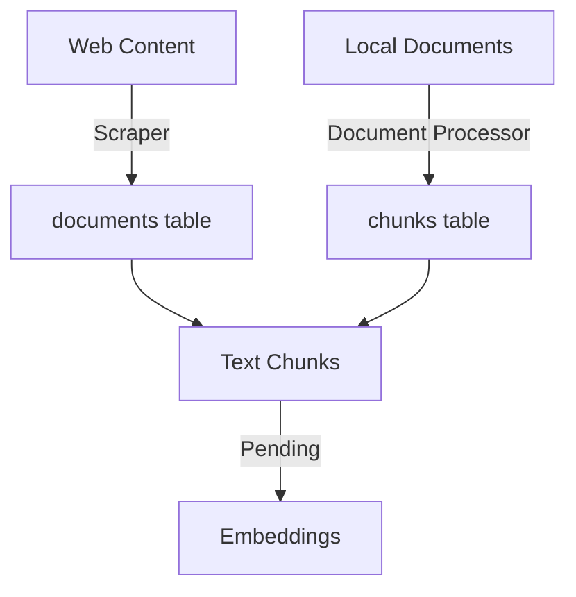

# ERCOT RAG System Documentation

## 1. Project Overview
A Retrieval Augmented Generation (RAG) system for ERCOT documentation, focusing on market participant registration and qualification processes.

### Current Status
- Database schema implemented and optimized
- Web scraping completed (17 pages)
- Document processing partially completed (54/114 documents)
- Vector embedding generation pending
- Decision made to not process remaining legacy formats (.doc, .xls) due to limited scope (7 documents)

## 2. Database Design

### 2.1 Current Schema
```sql
-- URLs tracking table
CREATE TABLE urls (
    id BIGSERIAL PRIMARY KEY,
    url TEXT NOT NULL UNIQUE,
    status TEXT DEFAULT 'pending',
    last_attempted TIMESTAMP,
    error_message TEXT
);

-- Documents table (both web and local)
CREATE TABLE documents (
    id BIGSERIAL PRIMARY KEY,
    url TEXT NOT NULL,
    title TEXT NOT NULL,
    content_type TEXT NOT NULL,  -- 'web' or 'document'
    file_name TEXT,             -- For local documents
    created_at TIMESTAMP DEFAULT CURRENT_TIMESTAMP,
    CONSTRAINT unique_document_url UNIQUE(url)
);

-- Text chunks table
CREATE TABLE chunks (
    id BIGSERIAL PRIMARY KEY,
    document_id BIGINT REFERENCES documents(id) ON DELETE CASCADE,
    content TEXT NOT NULL,
    chunk_index INTEGER,
    created_at TIMESTAMP DEFAULT CURRENT_TIMESTAMP
);

-- Vector embeddings table
CREATE TABLE embeddings (
    id BIGSERIAL PRIMARY KEY,
    chunk_id BIGINT REFERENCES chunks(id) ON DELETE CASCADE,
    embedding vector(1024),
    model_version TEXT DEFAULT 'jina-embeddings-v3',
    tokens_used INTEGER,
    created_at TIMESTAMP DEFAULT CURRENT_TIMESTAMP,
    CONSTRAINT unique_chunk_embedding UNIQUE(chunk_id)
);
```

### 2.2 Schema Evolution
The schema evolved from a simpler version:
```sql
-- Original Schema
CREATE TABLE urls (
    id BIGSERIAL PRIMARY KEY,
    url TEXT NOT NULL UNIQUE,
    status TEXT DEFAULT 'pending'
);

CREATE TABLE documents (
    id BIGSERIAL PRIMARY KEY,
    url TEXT NOT NULL,
    title TEXT NOT NULL,
    content_type TEXT NOT NULL,
    created_at TIMESTAMP DEFAULT CURRENT_TIMESTAMP
);
```

### 2.3 Current Data Status
- Web content: 17 pages processed
- Documents: 114 total
  - 54 successfully processed
  - 60 remaining (53 web content, 7 legacy formats)
- Chunks: 7,296 generated
  - Average size: 362 characters
  - Range: 3-499 characters

## 3. Implementation Journey

### 3.1 Initial Over-Engineering Challenges
1. **Failed Schema Modifications**:
```sql
-- Attempted (Failed) Schema Updates
ALTER TABLE documents 
ADD COLUMN section_name TEXT;

-- Complex section mapping (removed)
UPDATE documents 
SET section_name = 
    CASE 
        WHEN title ILIKE '%credit%' THEN 'Credit'
        WHEN title ILIKE '%LSE%' THEN 'Load Serving Entities'
    END;
```

2. **Complex Directory Structure Issues**:
```python
# Overly complex path resolution (abandoned)
file_path = os.path.join(
    "data/documents",
    document.section_name,
    document.title
)
```

### 3.2 Failed Unified Processor Attempt
```python
class ContentProcessor:
    def __init__(self):
        self.base_url = "https://www.ercot.com"
        self.document_patterns = ['.docx', '.pdf', '.xls', '.xlsx']

    async def process_content(self):
        # Mixed concerns led to complications
        pass
```

### 3.3 Final Working Solution
1. **Simplified Database Management**:
```sql
-- Clean, necessary modifications only
ALTER TABLE documents ADD COLUMN file_name TEXT;
ALTER TABLE documents DROP COLUMN IF EXISTS section_name;
```

2. **Streamlined Document Processing**:
```python
def process_documents(directory: str) -> List[Dict]:
    """Process local document files"""
    for root, _, files in os.walk(directory):
        for file in files:
            file_path = os.path.abspath(os.path.join(root, file))
            # Simple file processing...
```

## 4. Implementation Stages

### 4.1 Completed Stages
1. **Web Scraping** ✓
   - URL discovery and tracking
   - Content extraction from ERCOT RQ section
   - Storage in documents table

2. **Document Processing** ✓
   - Local document download
   - Processing of supported formats (PDF, DOCX, XLSX)
   - Chunk generation and storage

### 4.2 Pending Tasks
1. **Embedding Generation**:
   - JINA embeddings implementation
   - Vector dimension: 1024
   - Token usage tracking

2. **RAG Functionality**:
   - Query processing
   - Vector similarity search
   - Response generation

## 5. Project Structure

### 5.1 File Organization
```plaintext
ercot_rag/
├── src/
│   ├── db/
│   │   ├── init_db.py          # Database setup
│   │   └── operations.py       # DB operations
│   ├── scraper/
│   │   └── crawler.py          # Web scraping
│   └── processor/
│       └── document_processor.py # Document processing
├── scripts/
│   └── verify_processing.py    # Status checking
└── data/
    └── documents/             # Local document storage
```

### 5.2 Processing Pipeline


## 6. Lessons Learned

### 6.1 Database Design
1. **Simplicity**:
   - Minimal necessary columns
   - No over-categorization
   - Clear content type separation

2. **File Management**:
   - Separate storage strategies
   - Simple path resolution
   - Flexible file finding

### 6.2 Processing Strategy
1. **Separation of Concerns**:
   - Independent web content handling
   - Separate document processing
   - Clear error handling

2. **File Handling**:
   - Directory tree traversal
   - Location-independent file finding
   - Proper error logging

## 7. Environment Setup
Required packages:
```bash
pip install openpyxl psycopg2-binary python-dotenv
pip install langchain beautifulsoup4 pandas
```

## 8. Known Issues and Decisions

### 8.1 Current Issues
1. **Chunk Size Variations**:
   - Minimum: 3 characters (too small)
   - Maximum: 499 characters
   - Optimization needed

2. **Web Content Filename**:
   - Shows as None in database
   - Expected behavior
   - Handled in queries

### 8.2 Strategic Decisions
1. **Legacy Format Support**:
   - Decision made to not implement .doc and .xls support
   - Affects only 7 documents
   - Cost-benefit analysis favors skipping implementation

## 9. Next Steps

### 9.1 Immediate Priorities
1. **Processing Verification**:
   - Chunk quality assessment
   - Metadata verification
   - Content completeness check

2. **Embedding Implementation**:
   - JINA AI integration
   - Token usage monitoring
   - Vector storage optimization

### 9.2 Future Enhancements
1. **RAG System**:
   - Query processing implementation
   - Similarity search optimization
   - Response generation refinement

2. **System Optimization**:
   - Chunk size standardization
   - Query performance tuning
   - Storage optimization