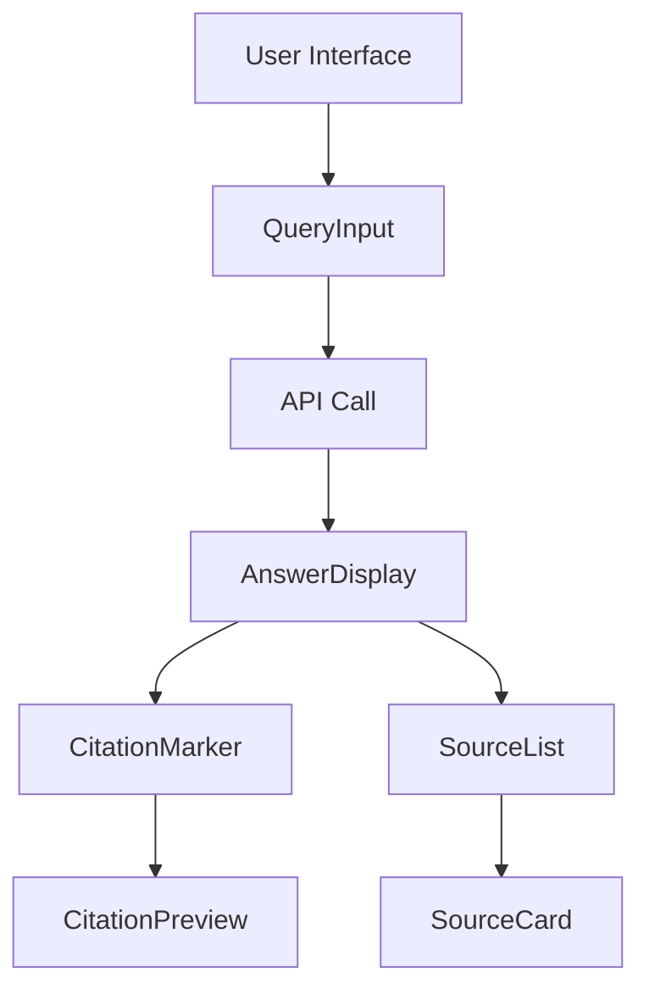

# ERCOT RAG System: Frontend Implementation Documentation

## 1. Current Implementation Overview

### 1.1 Architecture


## 2. Component Structure

### 2.1 Core Components
```plaintext
app/
├── components/
│   ├── rag/
│   │   ├── QueryInput.tsx       # Search interface
│   │   ├── AnswerDisplay.tsx    # Main response display
│   │   ├── CitationMarker.tsx   # Citation handling
│   │   ├── CitationPreview.tsx  # Hover previews
│   │   ├── SourceList.tsx       # Sources display
│   │   └── SourceCard.tsx       # Individual source
│   └── ui/
│       ├── Button.tsx           # Reusable button
│       ├── LoadingSpinner.tsx   # Loading indicator
│       ├── LoadingAnswer.tsx    # Answer skeleton
│       ├── ErrorMessage.tsx     # Error display
│       └── Toast.tsx            # Notifications
```

### 2.2 Component Details

#### QueryInput Component
```typescript
interface QueryInputProps {
    onSubmit: (query: string) => void;
    isLoading: boolean;
}
```
- **Purpose**: User query input interface
- **Features**:
  - Loading state handling
  - Input validation
  - Submit functionality
  - Error prevention

#### AnswerDisplay Component
```typescript
interface AnswerDisplayProps {
    answer: string;
    citations: Citation[];
    sources: Source[];
    processingTime: number;
}
```
- **Purpose**: Display RAG response with citations
- **Features**:
  - Citation integration
  - Source linking
  - Processing time display
  - Segment handling

## 3. Data Flow & Interactions

### 3.1 Query Processing Flow
1. User enters query in `QueryInput`
2. Main page handles API call
3. Loading state shown via `LoadingAnswer`
4. Response processed in `AnswerDisplay`
5. Citations linked to sources
6. Sources displayed in `SourceList`

### 3.2 Response Structure
```typescript
interface RAGResponse {
    query: string;
    answer: string;
    citations: Citation[];
    sources: Source[];
    processing_time: number;
    metadata: {
        total_sources: number;
        sources_used: number;
        token_count: number;
    }
}
```

## 4. Current Issues & Limitations

### 4.1 Link Functionality
1. **Source Links**:
   - Local file paths in URLs
   - Inaccessible in web environment
   - Need URL resolution strategy

2. **Citation Links**:
   - Square bracket format needs improvement
   - Navigation to sources needs refinement

### 4.2 Source Display
1. **Duplicate Sources**:
   - Multiple entries for same source
   - Need deduplication logic

2. **Content Quality**:
   - Placeholder excerpts (T T T...)
   - Need meaningful content extraction

### 4.3 UI/UX Issues
1. **Formatting**:
   - Basic text formatting
   - Limited visual hierarchy
   - Need enhanced readability

2. **Interactivity**:
   - Limited feedback mechanisms
   - No retry functionality
   - Missing related queries

## 5. Planned Improvements

### 5.1 Link Enhancement
```typescript
// Planned URL handling
interface Source {
    title: string;
    url: string;
    publicUrl?: string;  // New field for web access
    type: 'web' | 'document';
    // ... other fields
}
```

### 5.2 Source Enhancement
1. **Content Display**:
   ```typescript
   interface SourceDisplay {
       title: string;
       relevance: number;
       excerpts: string[];
       metadata: {
           type: string;
           lastUpdated: string;
       }
   }
   ```

2. **Deduplication Logic**:
   - Track unique sources
   - Merge relevance scores
   - Combine excerpts

### 5.3 UI Improvements
1. **Visual Enhancement**:
   - Card-based design
   - Better typography
   - Visual hierarchy
   - Loading animations

2. **Interaction Enhancement**:
   - Hover previews
   - Smooth scrolling
   - Toast notifications

## 6. Next Steps

### 6.1 Immediate Priorities
1. Fix link functionality
2. Implement source deduplication
3. Improve content excerpts
4. Enhance visual design

### 6.2 Future Enhancements
1. Add related queries
2. Implement retry mechanism
3. Add feedback system
4. Enhance loading states

## 7. Implementation Notes

### 7.1 CSS Structure
```css
/* Current structure */
.prose max-w-none  /* Answer text */
.bg-blue-50       /* Citations */
.rounded-lg       /* Cards */
.shadow-sm       /* Subtle elevation */
```

### 7.2 Performance Considerations
1. Lazy loading for previews
2. Optimized rendering
3. Caching strategy
4. Error boundaries

## 8. Testing Strategy

### 8.1 Component Testing
```typescript
// Example test structure
describe('QueryInput', () => {
    it('handles submission correctly')
    it('shows loading state')
    it('validates input')
})
```

### 8.2 Integration Testing
1. API interaction
2. State management
3. Error handling
4. Loading states

## 9. Environment Setup

### 9.1 Development
```bash
npm install
npm run dev
```

### 9.2 Configuration
```plaintext
.env.local
├── NEXT_PUBLIC_API_URL=http://localhost:8000
└── # Other environment variables
```

## 10. Current Status Summary

### 10.1 Completed
- [x] Basic component structure
- [x] API integration
- [x] Citation system
- [x] Source display
- [x] Loading states
- [x] Error handling

### 10.2 In Progress
- [ ] Link functionality
- [ ] Source deduplication
- [ ] UI enhancement
- [ ] Content quality

### 10.3 Pending
- [ ] Advanced features
- [ ] Performance optimization
- [ ] Testing implementation
- [ ] Documentation updates