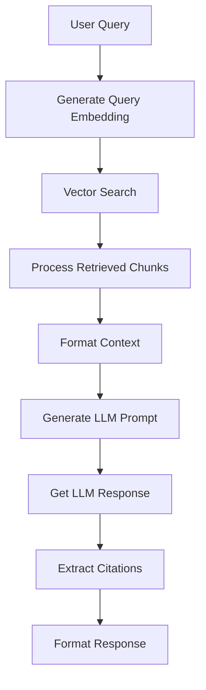
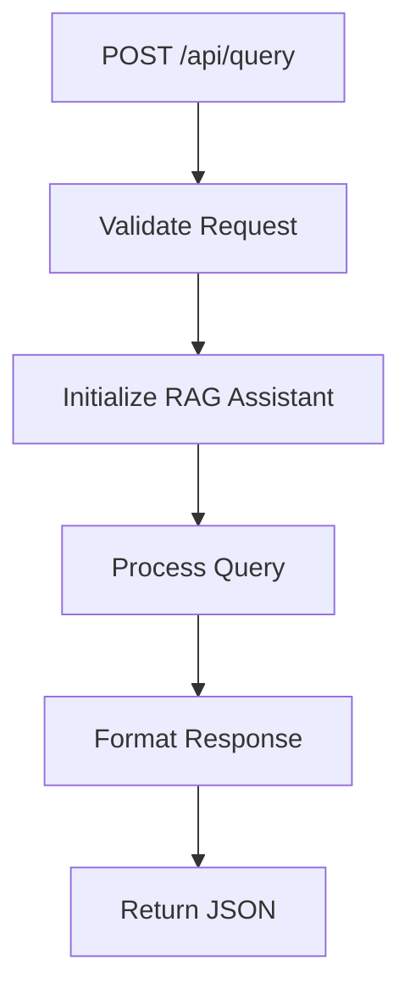

# ERCOT RAG System: Processing Pipeline Documentation

## 1. RAG Assistant Processing Pipeline

### 1.1 Query Processing Flow


### 1.2 Vector Search Implementation
```python
async def vector_search(self, query: str, k: int = 5):
    """
    1. Generate query embedding using JINA AI
    2. Convert embedding to PostgreSQL vector format
    3. Use HNSW index for similarity search
    4. Join with documents table for metadata
    5. Return top-k similar chunks with context
    """
    query_embedding = self.embeddings.embed_query(query)
    embedding_str = f"[{','.join(map(str, query_embedding))}]"
    
    # Main search query with HNSW index
    cur.execute("""
        WITH chunk_data AS (
            SELECT 
                c.id,
                c.content,
                c.document_id,
                d.title,
                d.content_type,
                d.file_name,
                d.url,
                (e.embedding <=> %s::vector) as distance
            FROM chunks c
            JOIN documents d ON c.document_id = d.id
            JOIN embeddings e ON c.id = e.chunk_id
            ORDER BY e.embedding <=> %s::vector
            LIMIT %s
        )
        SELECT * FROM chunk_data
    """)
```

### 1.3 Context Processing
```python
def create_prompt(self, query: str, chunks: List[Dict]):
    """
    1. Process retrieved chunks
    2. Format source information
    3. Create contextualized prompt
    4. Add specific guidelines for response
    """
    sources_text = []
    for chunk in chunks:
        source = f"[{chunk['metadata']['title']}]"
        content = chunk['content']
        sources_text.append(f"{source}: {content}")
    
    # Structured prompt template
    prompt = f"""You are an expert assistant helping users understand ERCOT processes.
    Question: "{query}"

    Guidelines:
    1. Start with direct answer
    2. Use clear structure
    3. Always cite sources [Document Title]
    4. Include steps where applicable
    5. Highlight key requirements

    Sources:
    {chr(10).join(sources_text)}"""
```

### 1.4 Citation Extraction
```python
def extract_citations(self, text: str):
    """
    1. Find citation markers in text
    2. Extract source titles
    3. Track citation positions
    4. Clean final text
    5. Return citations list
    """
    citations = []
    modified_text = text
    
    # Extract [Source] citations
    citation_pattern = r'\[(.*?)\]'
    matches = re.finditer(citation_pattern, text)
    
    offset = 0
    for match in matches:
        start = match.start() - offset
        end = match.end() - offset
        source = match.group(1)
        
        citations.append(Citation(
            title=source,
            start_idx=start,
            end_idx=end
        ))
```

## 2. FastAPI Request Processing

### 2.1 Query Endpoint Flow


### 2.2 Request Processing
```python
@app.post("/api/query")
async def process_query(request: QueryRequest):
    """
    1. Validate incoming request
    2. Get RAG assistant instance
    3. Process query through pipeline
    4. Format response with citations
    5. Return structured JSON
    """
    try:
        assistant = await ERCOTRAGAssistant.get_instance()
        result = await assistant.process_query(request.query)
        
        # Process and format sources
        sources = []
        seen_docs = set()
        
        for chunk in result['chunks']:
            doc_id = chunk['metadata']['document_id']
            if doc_id not in seen_docs:
                sources.append({
                    'title': chunk['metadata']['title'],
                    'url': chunk['metadata']['url'],
                    'content': chunk['content'],
                    'relevance': 1 - chunk['distance']
                })
```

### 2.3 Response Processing
The FastAPI endpoint formats the RAG response into a structured JSON that includes:

1. **Main Answer**:
   ```json
   {
       "answer": "Processed answer with citations",
       "citations": [
           {
               "title": "Document Title",
               "start_idx": 123,
               "end_idx": 145
           }
       ]
   }
   ```

2. **Source Information**:
   ```json
   {
       "sources": [
           {
               "title": "Document Name",
               "url": "document://path",
               "content": "Source content",
               "relevance": 0.95,
               "highlights": [
                   "Key excerpt 1",
                   "Key excerpt 2"
               ]
           }
       ]
   }
   ```

## 3. End-to-End Processing Example

### 3.1 Query Processing
When a user asks about "ERCOT registration process":

1. **Vector Search**:
   - Query embedding generated
   - Similar chunks retrieved using HNSW index
   - Top matches combined with document metadata

2. **Context Assembly**:
   ```python
   # Retrieved chunks formatted as:
   sources_text = [
       "[Resource Handbook]: Registration process takes 10-15 days...",
       "[Application Form]: Standard Form Market Participant Agreement required...",
       "[Guidelines]: Must register as Resource Entity..."
   ]
   ```

3. **LLM Processing**:
   - Contextualized prompt created
   - Response generated with citations
   - Citations extracted and positions marked

4. **Response Formatting**:
   ```python
   response = {
       "answer": processed_text,
       "citations": extracted_citations,
       "sources": formatted_sources,
       "metadata": {
           "processing_time": time.time() - start_time,
           "sources_used": len(seen_docs)
       }
   }
   ```

### 3.2 Frontend Implications
This processing pipeline enables:
1. Clickable citations in answers
2. Source preview on hover
3. Direct links to documents
4. Relevance-based source ordering

## 4. Key Optimizations

### 4.1 Vector Search
- HNSW index for fast similarity search
- Batch processing of chunks
- Metadata joined in single query

### 4.2 Response Generation
- Structured prompt engineering
- Citation position tracking
- Source deduplication
- Highlight extraction

### 4.3 Performance Features
- Singleton RAG assistant
- Connection pooling
- Response caching potential
- Batch processing support

## 5. Next Steps

### 5.1 Frontend Integration
The processed response format supports:
1. Interactive citations
2. Source previews
3. Document linking
4. Relevance indicators

### 5.2 Potential Enhancements
1. Response caching
2. Batch processing
3. Real-time updates
4. Source filtering