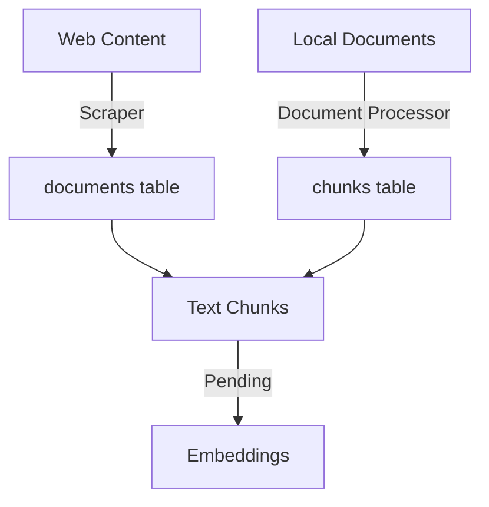

# ERCOT RAG System Documentation

## 1. Project Overview
A Retrieval Augmented Generation (RAG) system for ERCOT documentation, focusing on market participant registration and qualification processes.

### Current Status
- Database schema implemented
- Web scraping completed
- Document processing partially completed
- Some document types pending processing
- Ready for embedding generation

## 2. Database Design

### Schema Overview
```sql
-- URLs tracking table
CREATE TABLE urls (
    id BIGSERIAL PRIMARY KEY,
    url TEXT NOT NULL UNIQUE,
    status TEXT DEFAULT 'pending',
    last_attempted TIMESTAMP,
    error_message TEXT
);

-- Documents table (both web and local)
CREATE TABLE documents (
    id BIGSERIAL PRIMARY KEY,
    url TEXT NOT NULL,
    title TEXT NOT NULL,
    content_type TEXT NOT NULL,  -- 'web' or 'document'
    file_name TEXT,             -- For local documents
    created_at TIMESTAMP DEFAULT CURRENT_TIMESTAMP,
    CONSTRAINT unique_document_url UNIQUE(url)
);

-- Text chunks table
CREATE TABLE chunks (
    id BIGSERIAL PRIMARY KEY,
    document_id BIGINT REFERENCES documents(id) ON DELETE CASCADE,
    content TEXT NOT NULL,
    chunk_index INTEGER,
    created_at TIMESTAMP DEFAULT CURRENT_TIMESTAMP
);

-- Vector embeddings table
CREATE TABLE embeddings (
    id BIGSERIAL PRIMARY KEY,
    chunk_id BIGINT REFERENCES chunks(id) ON DELETE CASCADE,
    embedding vector(1024),
    model_version TEXT DEFAULT 'jina-embeddings-v3',
    tokens_used INTEGER,
    created_at TIMESTAMP DEFAULT CURRENT_TIMESTAMP,
    CONSTRAINT unique_chunk_embedding UNIQUE(chunk_id)
);
```

### Current Data Status
- Web content: 17 pages processed
- Documents: 114 total
  - 54 successfully processed
  - 60 remaining (mix of web content and unsupported formats)
- Chunks: 7,296 generated
  - Average size: 362 characters
  - Range: 3-499 characters

## 3. Implementation Stages

### Stage 1: Web Scraping ✓
- Implemented URL discovery and tracking
- Scraped web content from ERCOT RQ section
- Stored in documents table with content_type='web'

### Stage 2: Document Processing ✓
- Downloaded documents locally
- Processed supported formats:
  - PDF files
  - DOCX files
  - XLSX files (using openpyxl)
- Created text chunks
- Stored in chunks table

### Stage 3: Pending Tasks
1. **Document Format Support**:
   - .doc files (need Word COM object)
   - .xls files (need xlrd library)
   - Handle any encrypted documents

2. **Processing Status**:
   ```python
   Successfully processed: 54 documents
   Remaining: 60 documents
   - Web content with None filenames
   - Unsupported document formats
   ```

3. **Embedding Generation**:
   - Not started yet
   - Will use JINA embeddings
   - Vector dimension: 1024

## 4. File Organization

```plaintext
ercot_rag/
├── src/
│   ├── db/
│   │   ├── init_db.py          # Database setup
│   │   └── operations.py       # DB operations
│   ├── scraper/
│   │   └── crawler.py          # Web scraping
│   └── processor/
│       └── document_processor.py # Document processing
├── scripts/
│   └── verify_processing.py    # Status checking
└── data/
    └── documents/             # Local document storage
```

## 5. Processing Pipeline


## 6. Next Steps
1. Add support for remaining document formats:
   ```python
   # Unsupported formats
   .doc  - Old Word format
   .xls  - Old Excel format
   ```

2. Complete document processing:
   - Handle remaining 60 documents
   - Verify all chunks are properly created

3. Implement embedding generation:
   - Use JINA AI API
   - Store in embeddings table
   - Track token usage

4. Add RAG functionality:
   - Query processing
   - Vector similarity search
   - Response generation

## 7. Known Issues
1. Some document types unsupported:
   ```python
   - .doc files showing "Skipping .doc file (unsupported)"
   - .xls files failing with "File is not a zip file"
   ```

2. Web content showing as None filenames:
   ```python
   - Normal behavior for web content
   - Can be filtered in queries
   ```

3. Chunk size variations:
   ```python
   - Min size: 3 characters (too small)
   - Max size: 499 characters
   - Might need chunk size optimization
   ```

## 8. Environment Setup
Required packages:
```bash
pip install openpyxl xlrd psycopg2-binary python-dotenv
pip install langchain beautifulsoup4 pandas
```

For pending document types:
```bash
pip install pywin32  # For .doc files
pip install xlrd     # For .xls files
```